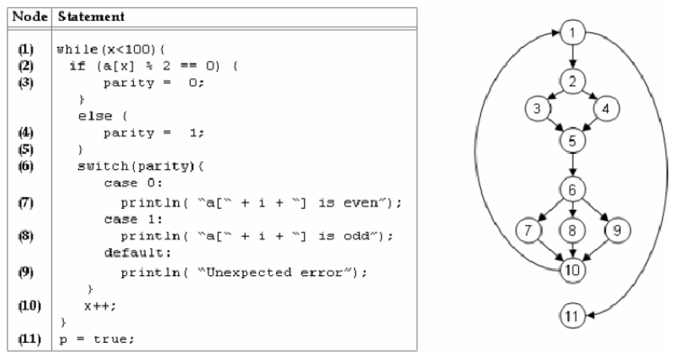

# Handling Null Values

Tim asked me to give this talk after a discussion we had about reducing complexity.

This is not a talk where I implore you to do something.  It is rather a talk to expose you to a mindset/technique that might be different and interesting.

I'm going to briefly explain a mindset and coding approach that has helped me reduce complexity by placing more importance on the decoding/encoding layer that always exists between the outside world and my program.

I'll also cover how Scala uses `Option[A]` to indicate missing values.  This has almost eliminated null from my consideration.  Scala 3 will allow us to turn nulls off and they effectively won't exist in my programs.

## The TL/DR;

In short, we combine a few things to reduce complexity and errors associate with null values as well as with other incorrect values:

- We view our programs' interactions with the outside world through an abstraction:
  - Any HTTP request, SQS message, cron event, etc. is really the 'outside world' wanting to invoke some particular function, such as 'CustomerId => Option[Customer]'
    - Since the outside world can't send well-typed values, we have contracts (even for async messaging)
      - We probably should have used AsyncAPI for SQS or other async contracts, but we used swagger
      - We are fairly strict about the types in these
    - All such invocations come as bytes, which are decoded by functions to well-typed models that always look like this:
      - `String/Array[Byte] => Try[SomeModelClass]` (decoding can always fail)
        - I treat these, and the contracts, as _holy_.
      - We have a strong bias toward required values - optionals require justification
      - We aggressively try to minimize input values - fields we don't care about, redundancy, etc.
      - I try to type my models as accurately as possible, e.g a UUID is a `UUID`, a URL is a `URL`
        - This reduces edge cases downstream in the program
      - We model optional values in the type system, e.g. `Option[String]`.  If a field is a non-optional type, I assume it will not be null.
      
## Viewing Missing Values as Increased Complexity

This is probably review, but I want to mention it as I will be referring to it.

Cyclomatic complexity is a common measure of function or program complexity, as exemplified here:



This code has complexity 5, because there are 4 decisions (which can be observed as 'cycles' in the graph if you ignore the arrows) plus one.

### How do Missing Values Affect Complexity?

Suppose we had the corresponding class:

```scala
case class Foo(bar: String, baz: String, biz: String)
```

In general, N optional fields create 2^N potential edge cases.  Complexity grows quickly!  Are you really thinking about whether these situations make sense?

| Foo  | Bar      | Baz  |
|------|----------|------|
| N    | N        | N    |
| N    | N        | Y    |
| N    | Y        | N    |
| N    | Y        | Y    |
| Y    | N        | N    |
| Y    | N        | Y    |
| Y    | Y        | N    |
| Y    | Y        | Y    |

### Scala Option[A]

### Bias Toward Required Values

We now start from a place where we assume values are present and only relax to optional values if we can answer what it means when a value is optional and whether it's justified.

### Importance of Well-Typed Contracts

We use contracts for all interactions, even async messaging.  For async messaging, we should probably be using somthing like [asyncapi](https://www.asyncapi.com/) but are using swagger today.

### Decoding to Models

Any message that comes in is really an attempt by the outside world to invoke some function `A => B`, e.g. `CustomerRequest => Option[Customer]`.  However, the outside world can't send scala values, so it sends bytes in some form.  There is always a decoding function that looks something like `String/Array[Byte] => Try[SomeModel]`.

_I treat these functions as holy._  They are the guard dogs that prevent complexity from creeping into my program.

#### Warning about Protobuf (or similar) Class Generation

A problematic pattern I've observed is using code generation to create classes from protobufs or similar formats and using those throughout the program.  I have seen a lot of problems from this at Deere because those protos are not owned by us and carry a lot of baggage as well as loose typing.  We now typically decode from bytes to the generated classes and then from those to models.  The generated classes tend to be really, really poor at expressing contracts - filled with optional fields that are really required, redunant fields, etc.

### Concrete Example

Recently we refactored some core models in one of our applications to make two changes:

- One field which was optional became required
- Three optional fields became one - they are all absent or all present - so we changed from:
  - `Option[Foo], Option[Bar], Option[Baz]` to `Option[Bizz]` where we had `case class Bizz(foo: Foo, bar: Bar, baz: Baz)`

In doing so, we eliminated a lot of code and bugs such as:

- Assuming that since Foo exists, the other fields existed
- Incorrectly populating only two of these three fields (production code)
- Tests which were not actually testing the desired scenario because mistakes were made in field population
- Many redundant checks for absence of values which didn't make sense


## Scala 3 'Explicit Null' Feature

In Scala 3, the [new explicit nulls feature](https://dotty.epfl.ch/3.0.0/docs/reference/other-new-features/explicit-nulls.html) supports compiler flags '-Yexplicit-nulls' and '-Ysafe-init' to further reduce nulls from consideration.

```scala
val x1: String = null // Will not compile, found `Null`, but required `String`

val x2: String | Null = null // ok, because the type of x is String OR Null

// The compiler would make us handle these:
def handleValue(x: String | Null) = x match {}
  case Null => ...
  case String => ...
}

assert(someString != null) // Will not compile, String can not be compared with Null
```

When calling a Java API with these compiler options set, Scala will automatically patch the Java methods to indicate what they return.

```scala
val x3: String = someJavaClass.getName // Will not compile
val x4: String | Null = someJavaClass.getName // Fine
```

This doesn't happen if the Java `@NotNull` annotation is used.  Is this wise?  I don't think so, since `@NotNull` doesn't do anything by itself.  I'm puzzled by this choice.